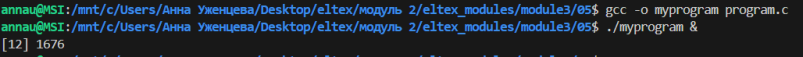
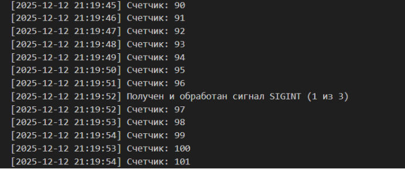
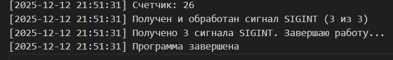
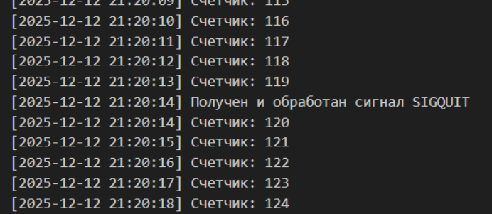
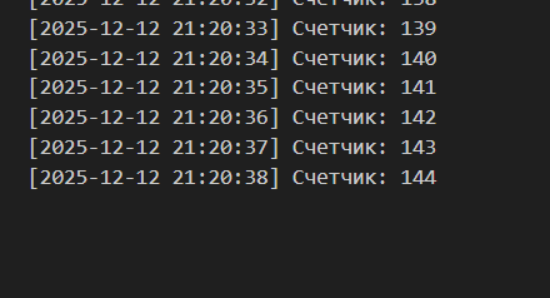
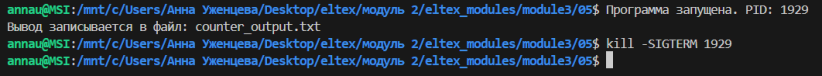
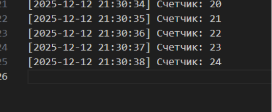
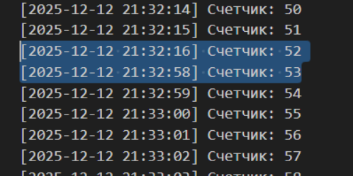
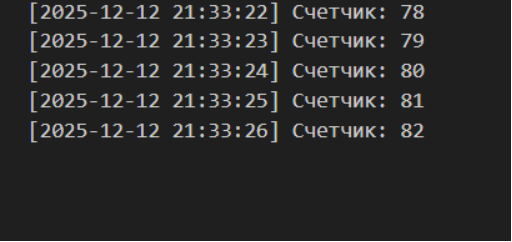

## Задание
Задание 05 (Сигналы).
Написать программу, бесконечно выводящую в файл 1 раз в секунду значение внутреннего счетчика (1 2 3 ...). Программа должна завершаться после третьего сигнала SIGINT. При получении сигнала SIGINT или SIGQUIT в файл записывается строка, что получен и обработан сигнал (использовать одну функцию-обработчик сигнала). Не забывайте закрывать
файл!  
Запустить программу в фоновом режиме (myprogram &). Узнать идентификатор процесса и протестировать команды управления (SIGINT, SIGQUIT, SIGABRT, SIGKILL, SIGTERM, SIGTSTP, SIGSTOP, SIGCONT). Для сдачи задания нужно прислать исходный код программы и скриншоты с комментариями (что тестируется, какое результат вы ожидаете и что фактически получилось).

## Код для проверки
```
# SIGINT (обычно Ctrl+C в терминале)
kill -SIGINT <PID>

# SIGQUIT (обычно Ctrl+\ в терминале)
kill -SIGQUIT <PID>

# SIGABRT
kill -SIGABRT <PID>

# SIGTERM
kill -SIGTERM <PID>

# SIGTSTP (приостановка, обычно Ctrl+Z)
kill -SIGTSTP <PID>

# SIGSTOP (нельзя перехватить)
kill -SIGSTOP <PID>

# SIGCONT (продолжение после остановки)
kill -SIGCONT <PID>

# SIGKILL (нельзя перехватить или игнорировать)
kill -SIGKILL <PID> 
```

## Тестируем

Код для компиляции и запуска:
```
gcc -o myprogram program.c
./myprogram &
```

Запустим программу (PID будет меняться т.к. программа останавливалась и запускалась снова во время тестирования)  


### Ожидаемые и получившиеся результаты тестирования

* SIGINT (2): Будет обработан, записано сообщение в файл. После 3-го сигнала программа завершится.  
  
  

* SIGQUIT (3): Будет обработан, записано сообщение в файл, но не повлияет на счетчик SIGINT.  
 


* SIGABRT (6): Не обрабатывается явно, поэтому завершит программу.  


* SIGTERM (15): Не обрабатывается явно, поэтому завершит программу.  
  
  

* SIGTSTP (20): Игнорируется программой (но вообще останавливает процесс).  

> Ничего не произошло

* SIGSTOP (19): Немедленно приостанавливает процесс (нельзя перехватить).  
* SIGCONT (18): Возобновляет приостановленный процесс.  
    

> Программа была остановлена в 21:32:15 и продолжила работать в 21:32:58

* SIGKILL (9): Немедленно убивает процесс (нельзя перехватить или игнорировать).  
  
