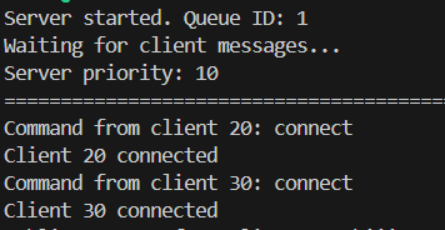
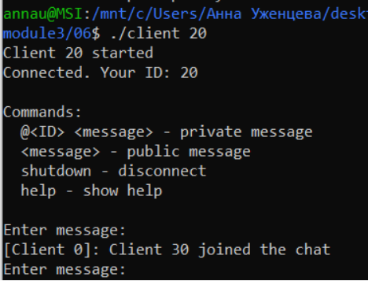
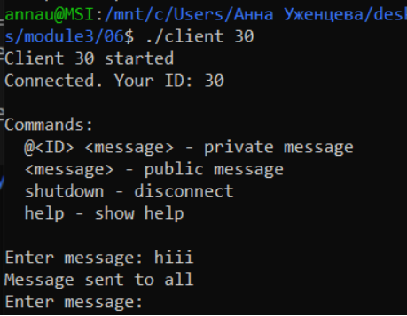
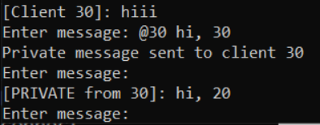
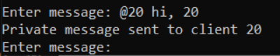
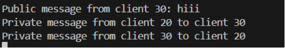
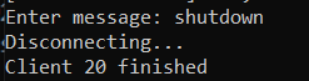
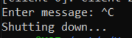

## Задание 06 (Очереди сообщений System V).
Написать две программы, использующие одну очередь сообщений для взаимодействия множества процессов (групповой чат). Первая программа – сервер, создает очередь сообщений, принимает сообщения от клиентов и пересылает их другим клиентам. Вторая программа – клиент, подключается к очереди и отправляет сообщения серверу, а также выбирает из очереди сообщения, адресованные клиенту. Может быть запущено сразу несколько экземпляров клиентов. Для идентификации получателя используется приоритет: 10 – сервер,
20, 30, 40,... – другие клиенты. Номер клиента указывается в его аргументах
запуска.
В исходящих сообщениях указывается номер отправителя (приоритет) и сам текст сообщения. Сервер ведет учет подключенных клиентов. Если клиент прислал сообщение «shutdown», сервер перестает пересылать сообщения этому клиенту.

## Компиляция и запуск (в разных терминалах для клиентов)
```
make
./server
./client 20
./client 30
```

## Тест программ

* Запустим сервер, одключимся от имени клиентов 20 и 30.
  
  
  

* От имени клиента 30 было отправлено сообщение всем. Вот как это видно у клиента 20:  
Пусть клиент 20 напишет приватное сообщение клиенту 30, а тот ему ответит.  

20:
  

30: 
 

Вот так это видно на сервере:
 

* Теперь покинем сервер  

От имени клиента 20 напишем ``` shutdown ```:  


От имени клиента 30 зажмем Ctrl+C:  


На сервере тоже зажмем Ctrl+C: 
 