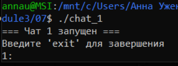
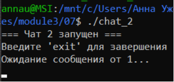
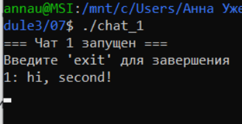
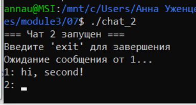
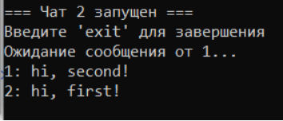
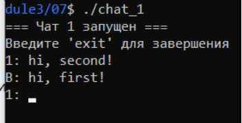
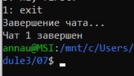
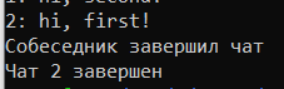

## Задание 07 (Очереди сообщений POSIX).
Написать две программы, использующие две очереди сообщений для двухстороннего взаимодействия (персональный чат)  
Сообщения отправляются по очереди (пинг-понг).  
Для завершения обмена предусмотреть отправку данных с заранее известным приоритетом.  

## Компиляция и запуск (каждый чат на отдельном терминале)

```
make
./chat_1
./chat_2
```

## Проверка

* Запустим оба чата  
Первый:  
  

Второй:  
 

В первом чате есть возможность написать сообщение, во втором просят дождаться первого.  

* Напишем сообщение из первого чата  
   

Сообщение пришло во второй чат:  
  

* Напишем ответ  
  

Ответ пришел:  
  

* Завершим программу в чате 1  
  

Во втором чате появилось уведомление о завершении чата:  

