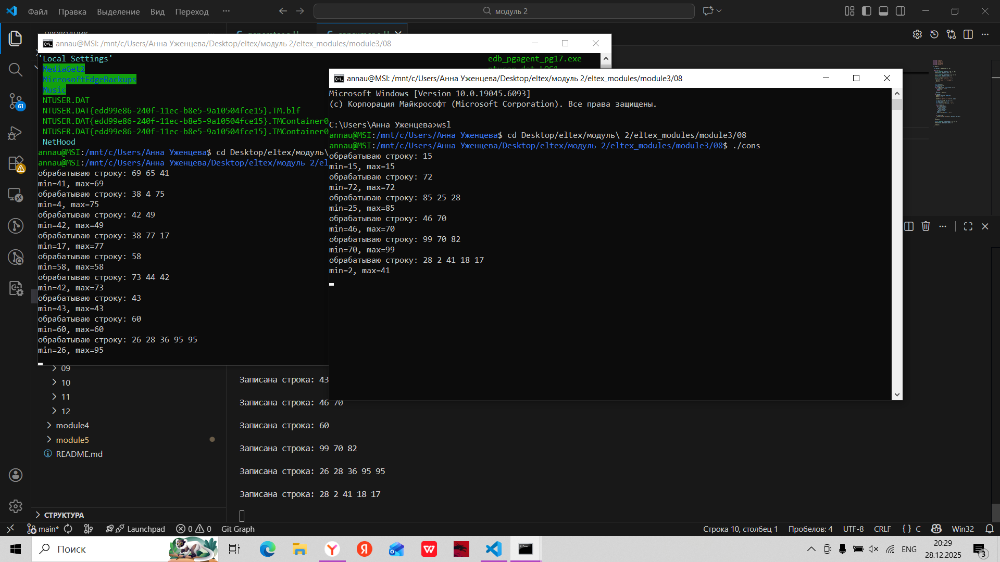
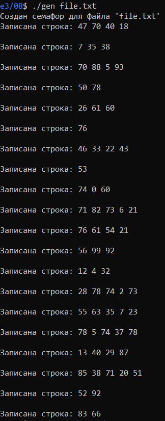
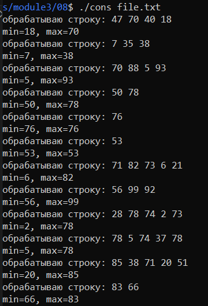
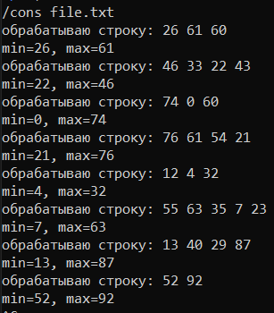
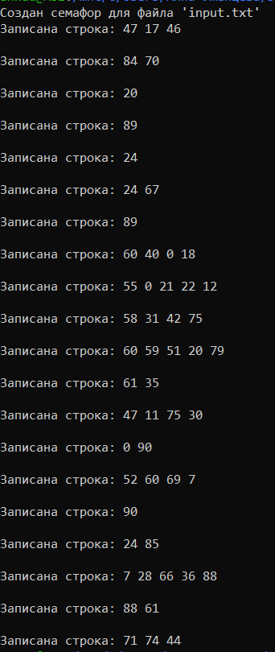
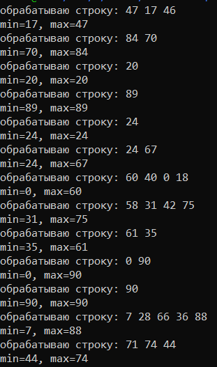
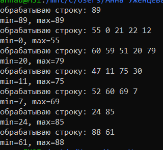

## Задание 08 (Семафоры System V)
Модель «производитель-потребители». Процесс-производитель генерирует строки (наборы из случайного количества случайных чисел) и
записывает их в файл. Процесс-потребитель анализирует строки (если в файле есть необработанные строки): в каждой строке находит максимальное и минимальное число и выводит эти значения на экран. Может быть запущено несколько экземпляров потребителей.  
Доступ к файлу управляется семафором.  
Усложнение: предусмотреть указание имени файла в аргументах запуска производителя и потребителя, чтобы можно было запускать несколько экземпляров производителей. При этом для управления доступом к каждому файлу используется «свой» семафор.

#### Версия с одним производителем
- Изменения  
Теперь файл передается в качестве аргумента при запуске программы. Чтобы у каждого файла был семафор, была написана функция для генерации ключа из имени файла:  
```
int get_semaphore(const char *filename, int create_new) {
  key_t sem_key = ftok(filename, 'P');
  if (sem_key == -1) {
    perror("Ошибка ftok");
    exit(1);
  }

  int flags = create_new ? (IPC_CREAT | 0666) : 0;
  int sem_id = semget(sem_key, 2, flags);

  if (sem_id == -1) {
    perror("Ошибка semget");
    exit(1);
  }

  if (create_new) {
    semctl(sem_id, 0, SETVAL, 0);
    semctl(sem_id, 1, SETVAL, 1);

    printf("Создан семафор для файла '%s'\n", filename);
  }

  return sem_id;
}
```  
Для удобства общие функции вынесены в файл common.c.  
- Компиляция и запуск  
```
gcc generator.c common.c -o gen
gcc consumer.c common.c -o cons

//далее запуск в разных терминалах

./gen
./cons
./cons
// ... 
```

- Проверка работы
Для проверки программы я открыла 3 терминала. В нижнем запускается производитель, выше - потребители. На изображении можно увидеть как потребители распределают между собой строки.   
  

Осуществим программу с несколькими производителями.

#### Версия с несколькими производителями
- Компиляция и запуск
```
gcc generator.c -o gen
gcc consumer.c -o cons

//далее запуск в разных терминалах

./gen filename.txt
./cons filename.txt
./cons filename.txt
// ... 
```

- Проверка работы
Для проверки запустим 6 терминалов (2 производителя, у каждого 2 потребителя). Далее будут скриншоты для всех шести терминалов.

Производитель 1:  
   
Потребитель 1.1:  
  
Потребитель 1.2:  
  

Производитель 2:  
  
Потребитель 2.1:  
  
Потребитель 2.2:  
  

Каждый производитель генерировал 20 строк. Первый потребитель каждого производителя обрабатывал больше строк, т.к. требовалось время на их запуск.  
