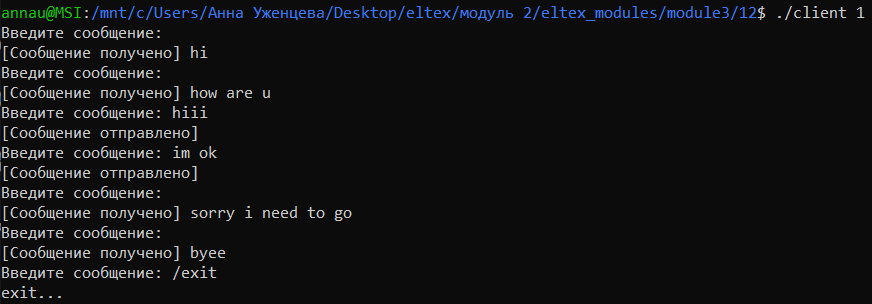
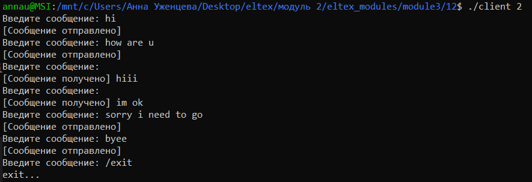

## Задание 12 (UDP сокеты)
Реализовать чат для двух клиентов с использованием UDP-сокетов. Предусмотреть «асинхронное» взаимодействие (отправку сообщений в любом порядке).

- Каждый чат запускается в отдельном терминале, номер клиента (1 или 2) передается в качестве аргумента. Для выхода из чата (завершения программы) нужно ввести ``` /exit ```.
- Две копии программы на одном компьютере общаются напрямую через UDP-сокеты. Каждая программа имеет свой уникальный порт и знает порт собеседника.
- Компиляция и запуск
```
gcc client_chat.c -o client
// в разных терминалах
./client 1
./client 2
```
- Демонстрация работы
На скриншотах представлен чат от имени каждого клиента.  
   
  