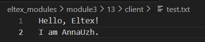
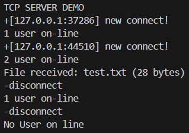
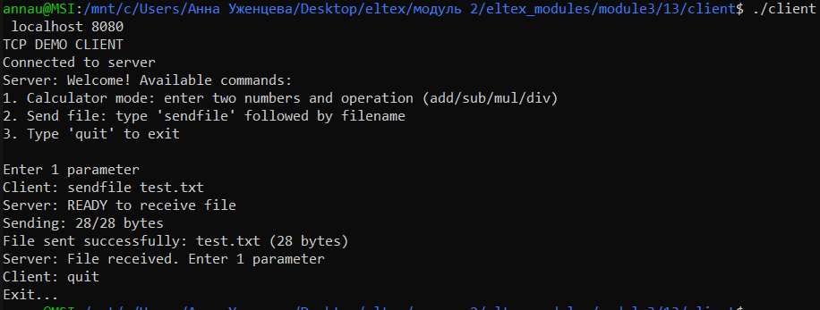
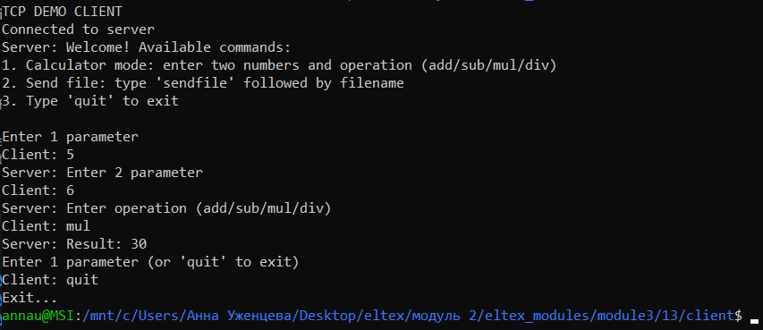
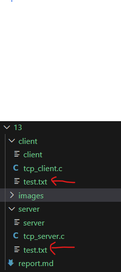
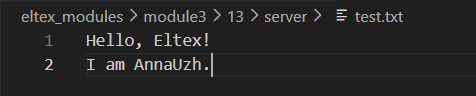

## Задание 13 (TCP сокеты)
Отладить программы ТСP-клиента и сервера из лекции. Добавить возможность вычисления разности, произведения, частного
двух чисел. Необходимое математическое действие указывает клиент. 

#### Реализация
Для передачи файлов поместим файл с программой для клиента в одну директорию, для сервера - в другую.
- Компиляция (выполняется в разных директориях)  
```
gcc tcp_server.c -o server
gcc tcp_client.c -o client
```

- Для проверки работы программы был создан файл ```test.txt``` в папке ```client```   
  

- Запустим программу в разных терминалах: сервер и два клиента. Вот порядок выполненных команд:
```
// server
./server 8080

// client 1
./client localhost 8080

// client 2
./client localhost 8080

// client 2
5
6
mul

// client 1
sendfile test.txt

// client 2
quit

// client 1
quit
```
- Скриншоты всех терминалов    
Server:  
  
Client 1:  
  
Client 2:  
  

На скриншотах видно успешное выполнение умножение и передачу файла. В папке с сервером так же можно увидеть файл test.txt:  
  
Проверим его содержимое:  
  


