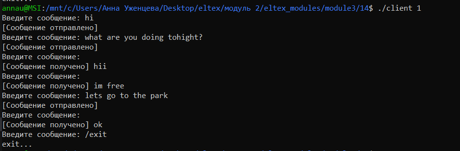
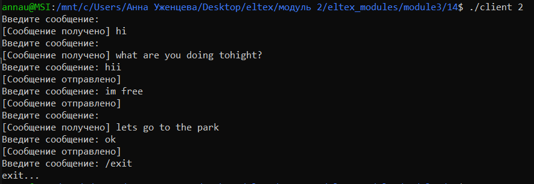
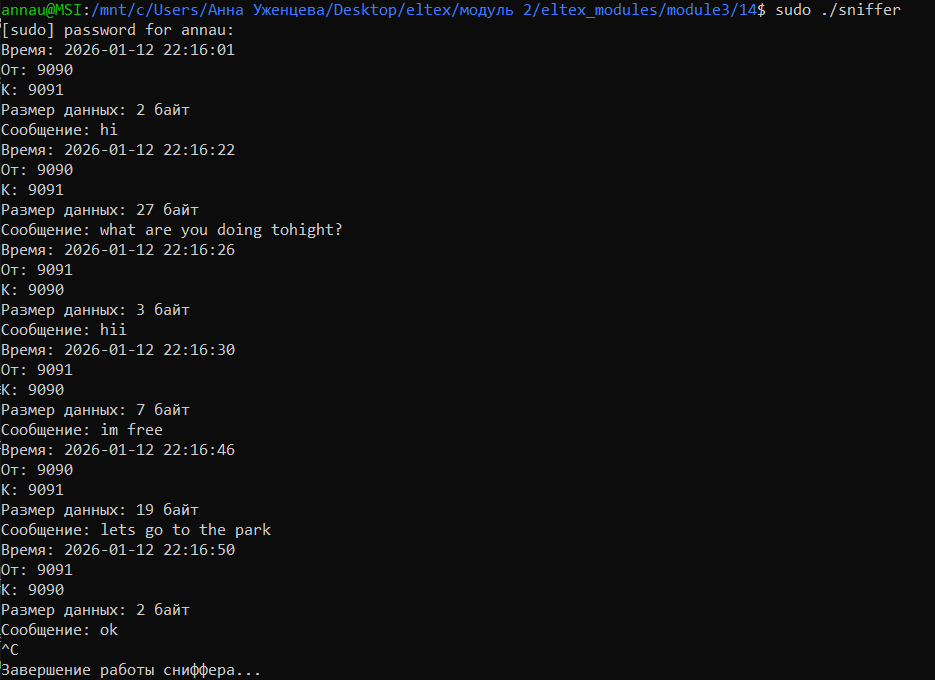
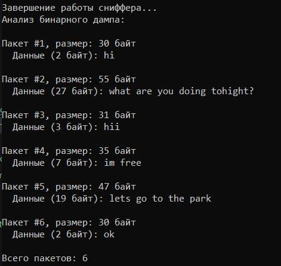

## Задание 14 (RAW сокеты)
Написать программу, получающую копии пакетов, предназначенных приложению-серверу из задачи 12 (снифер).
Программа может формировать дамп данных, который нужно вручную проанализировать (просмотр бинарных файлов) и убедиться, что это
действительно информация от программы-клиента.
Можно дополнить программу так, чтобы она расшифровывала и выводила в файл или на экран полученные сообщения.

- Компиляция и запуск
```
gcc client_chat.c -o client
gcc sniffer.c -o sniffer
// в разных терминалах
sudo ./sniffer
./client 1
./client 2
```

В процессе диалога двух чатов сообщения выводятся в терминал, где был запущен сниффер. Помимо этого, они выводятся в бинарный и текстовый файлы. При завершении программы в консоль выводится анализ информации из бинарного файла.  

- Проверка работы программы  
В разных терминалах были запущены программы для клиентов:  
  
  
В процессе диалога в терминале сниффера выводились те же сообщения:  
  
После завершения программы была проанализирована и выведена информация из бинарного файла:  
  
- Посмотрим содержимое текстового файла (первые несколько сообщений)  
Здесь подробно выводится информация о полученных пакетах.    
  
