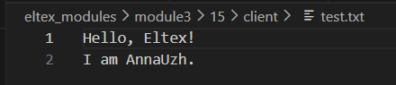
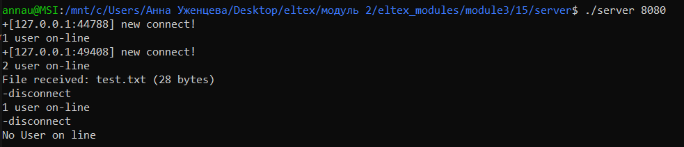
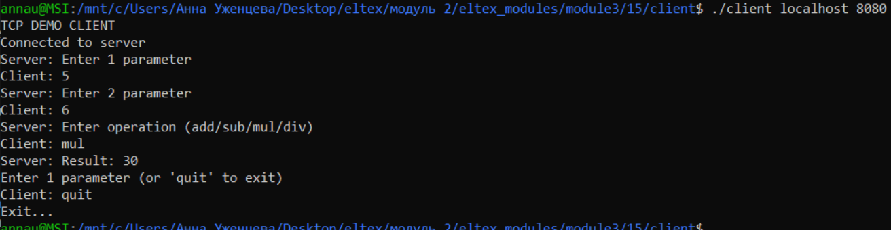
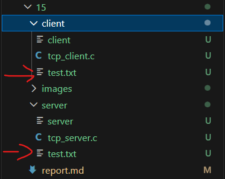
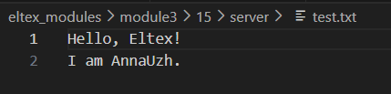

## Задание 15 (Мультиплексирование)
Реализовать программу-сервер, написанную при решении задачи 13, с использованием мультиплексирования ввода-вывода и одного потока исполнения.  
Можно применить любую функцию (select/poll/epoll).

#### Реализация
Для передачи файлов поместим файл с программой для клиента в одну директорию, для сервера - в другую.
- Компиляция (выполняется в разных директориях)  
```
gcc tcp_server.c -o server
gcc tcp_client.c -o client
```

- Для проверки работы программы был создан файл ```test.txt``` в папке ```client```   
  

- Изменения (по сравнению с 13 заданием)  
Появился массив, содержащий файловые дескрипторы клиентов ``` int client_sockets[FD_SETSIZE]; ```.  
Теперь при подключении нового клиента, он добавляется в массив, новые процессы не создаются. Для хранения сообщений и информации о клиентах появилась структура состояния клиента.    
```
typedef struct {
    int sockfd;
    int state;
    int param1;
    int param2;
    char operation[10];
    char filename[256];
} client_state_t;
```


- Запустим программу в разных терминалах: сервер и два клиента. Вот порядок выполненных команд:
```
// server
./server 8080

// client 1
./client localhost 8080

// client 2
./client localhost 8080

// client 2
5
6
mul

// client 1
sendfile test.txt

// client 2
quit

// client 1
quit
```
- Скриншоты всех терминалов    
Server:  
  
Client 1:  
  
Client 2:  
  

На скриншотах видно успешное выполнение умножение и передачу файла. В папке с сервером так же можно увидеть файл test.txt:  
  
Проверим его содержимое:  
  
