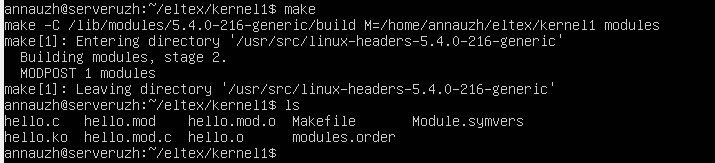
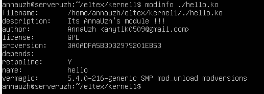
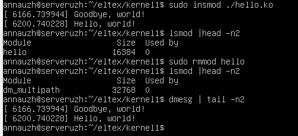

## Задание 1 по модулю 5  
Написать модуль ядра Hello World для своей версии ядра. Поменять описание модуля, добавить себя как автора и придумать свою лицензию.

- Собираем модуль:  
  

- Выведем информацию о модуле, включая заданные параметры:  
  

- Проверим работу модуля:  
  

