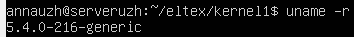
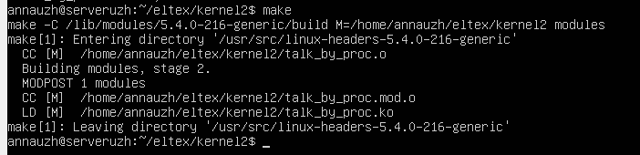
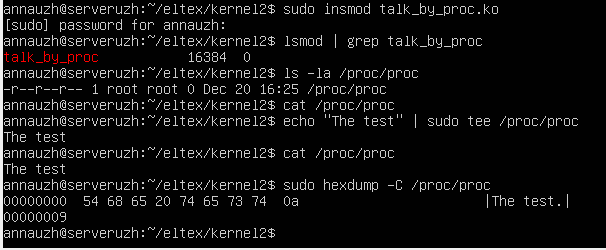

## Задание 2 по модулю 5: 
Написать модуль ядра для своей версии ядра, который будет обмениваться информацией с userspace через proc. Адаптировать для своей версии ядра (Структура обработчиков). Избавиться от харкода (маг чисел) и изолировать переменные модуля (static).  

- Для начала нужно узнать свою версию ядра:  
  
Версия 5.4 => используем структуру (до версии 5.5 включительно) 
``` 
file_operations
```  

- Компиляция:  
  

- Проверим работу:  
  