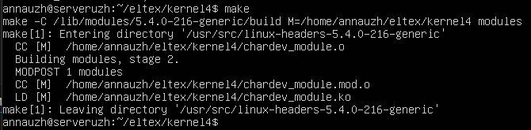
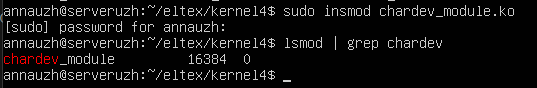
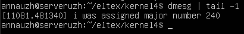
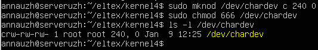
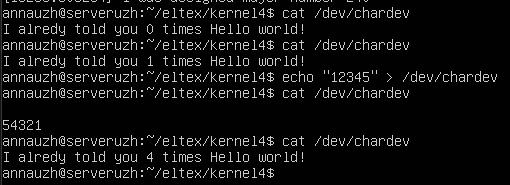

## Задание 4 по модулю 5: 
Написать модуль ядра для своей версии ядра, который будет обмениваться информацией с userspace через chardev. 
```
Пример кода: https://pastebin.com/EDFLWM3m
Предварительно прочитав главу 3 и 4 http://rus-linux.net/MyLDP/BOOKS/lkmpg.html
Еще документация https://linux-kernel-labs.github.io/refs/heads/master/labs/device_drivers.html
Пример где есть write https://appusajeev.wordpress.com/2011/06/18/writing-a-linux-character-device-driver/
```
- Компиляция:  
  

- Запуск  
  

- Сообщение о присвоении major number  
   

- Создание файла устройства  
  

- Проверим работу:  
  

После каждого открытия файла с помощью ``` cat ``` счетчик увеличивается на 1. При выполнении записи с помощью ```echo``` команда ```cat``` уже выводит записанную строку (программа ее переворачивает). Следующий ```cat``` работает как обычно, но каждая команда увеличила счетчик на 1 => на примере он увеличился сразу на 3.