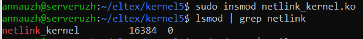
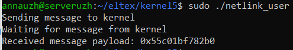
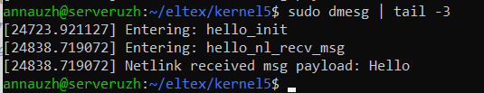

## Задание 5 по модулю 5: 
Написать модуль ядра для своей версии ядра, который будет обмениваться информацией с userspace через netlink. 

- Для реаоизации задания был написан модуль ядра ``` netlink_kernel.c ``` и программа для отправки сообщений из userspace ``` netlink_user.c ```.

- Компиляция и запуск  
  

- загрузка модуля  
  

- запуск пользователя  
  

- проверка логов  
  

- теперь добавим multicast. В модуль ядра добавляется функция ``` static void send_multicast_msg(const char *msg) ``` для multicast сообщений. Для получения соббщений добавлена программа ``` multicast.c ```.